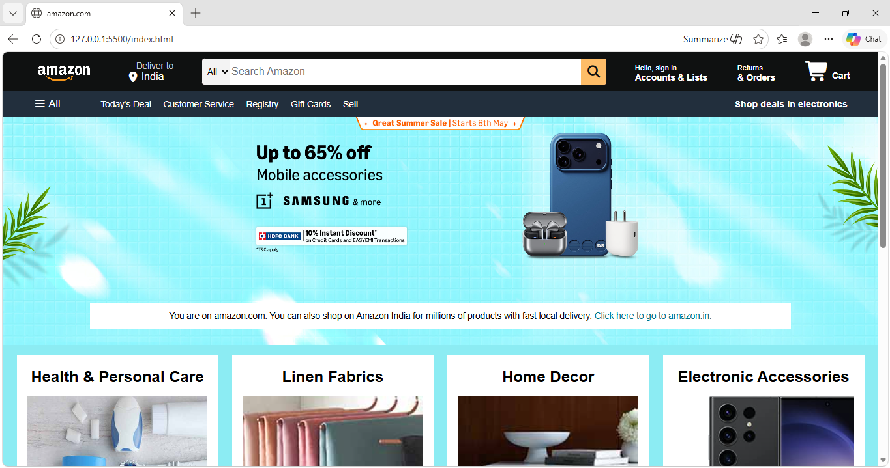

# Amazon Homepage Clone

A responsive clone of the Amazon homepage built using HTML and CSS. This project was created to practice frontend web development skills and improve understanding of webpage layouts, styling, and responsive designs.

# Features:

- 🔹Responsive Navigation Bar
- 🔹Amazon-style Homepage Layout
- 🔹Hero Banner
- 🔹Product Sections
- 🔹Clean and Modern UI Design

# Technologies:

- 🔹HTML5
- 🔹CSS3

# Learning Outcomes:

- 🔹HTML page structuring
- 🔹CSS styling and positioning
- 🔹Responsive web design
- 🔹Layout creation
- 🔹UI design principles

# Future Improvements:

- 🔹Add Javascript Functionality
- 🔹Create Login & Signup Pages
- 🔹Add Shopping Cart Functionality
- 🔹Improve Mobile Responsiveness
- 🔹Add Product Slider

# Acknowledgement

This project is created for educational and practice purposes only. Amazon name and design belong to amazon.com.